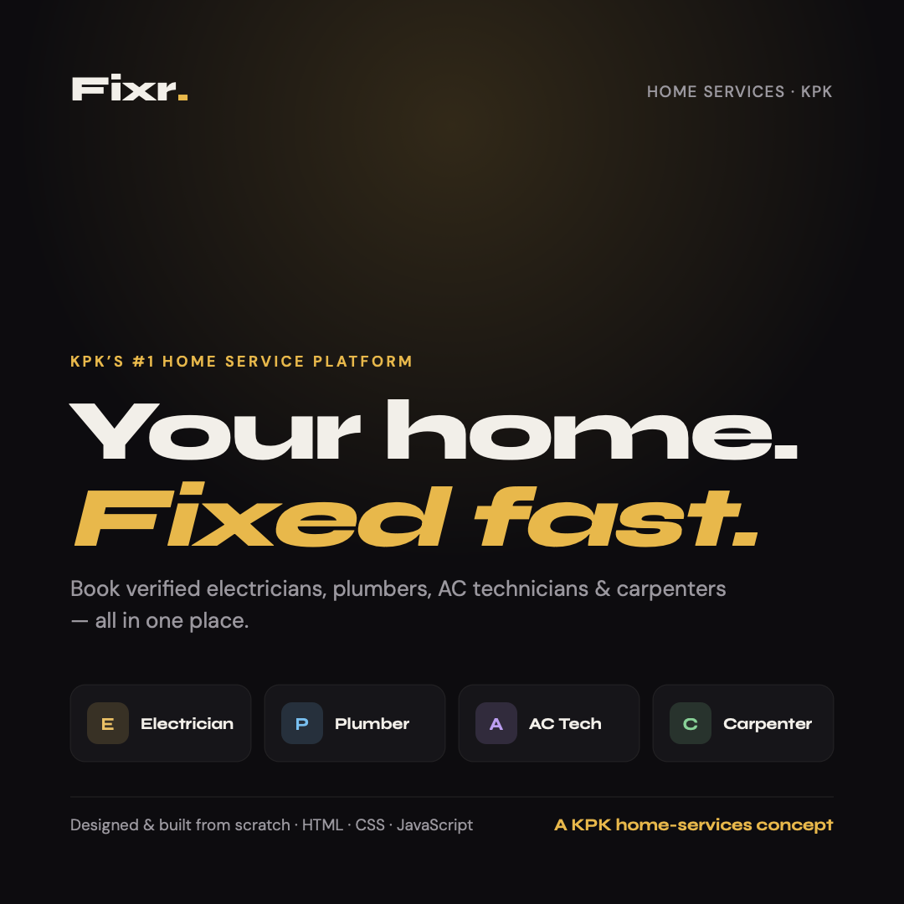

<div align="center">



# Fixr — Home Service Booking Platform

**KPK's home services, all in one place.**

[🌐 Live Demo](https://oopfixr.netlify.app) · Built with HTML · CSS · JavaScript

</div>

---

## Overview

**Fixr** is a home-services platform concept for the KPK region that connects people
with verified **electricians, plumbers, AC technicians, and carpenters** — all in one
place. Users can browse workers by category, book a service for a chosen date, and
leave a rating once the job is done.

I designed and developed the entire experience from scratch, with a focus on a clean,
effortless dark interface and thoughtful interactivity.

Built as part of my **Object-Oriented Programming** coursework at
**Pak-Austria Fachhochschule**.

## Features

- 🔎 **Browse & filter workers** by category (Electrician, Plumber, AC, Carpenter)
- 👤 **Account registration & login** flow
- 📅 **Service booking** with a live booking summary (worker, date, total)
- ⭐ **Ratings & reviews** for completed jobs
- 🗂️ **My Bookings** history view
- ✨ **Interactive UI** — cursor-aware service cards, scroll-reveal animations,
  animated statistics, and a sticky navigation bar
- 📱 **Fully responsive** with a mobile menu

## Tech Stack

| | |
|---|---|
| **Markup** | HTML5 |
| **Styling** | CSS3 (custom properties, `oklch` color, grid & flex) |
| **Logic** | Vanilla JavaScript |
| **Type** | Syne + DM Sans (Google Fonts) |
| **Hosting** | Netlify |

## Run Locally

```bash
# clone the repo
git clone https://github.com/<your-username>/fixr.git
cd fixr

# open index.html in your browser — no build step needed
```

## Project Structure

```
fixr/
├── index.html      # all pages (home, workers, booking, login, etc.)
├── fixr.css        # full stylesheet & design system
└── preview.png     # project cover
```

---

<div align="center">

Designed & built by **[Your Name]** · Pak-Austria Fachhochschule, KPK

</div>
